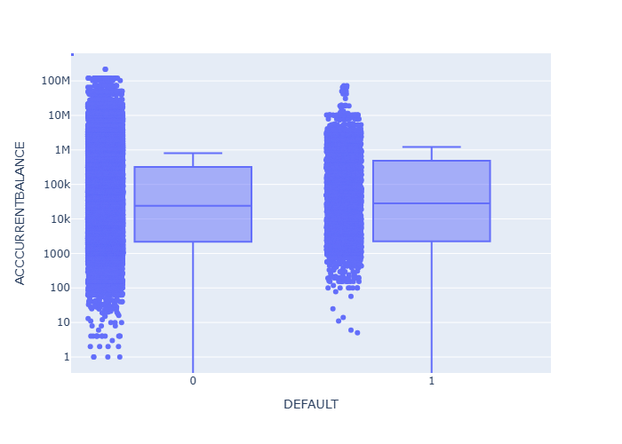

# Credit Risk DataSet Analysis

## Objective

Analyze a credit risk dataset to identify key factors and client segments associated with higher default risk.

## Source of Data

**Source:** https://www.kaggle.com/datasets/tahmidmir/credit-risk-dataset

This dataset contains information from the clients creditworthiness. It includes various demographic, financial, and behavioral attributes of borrowers.

## Process

- Data review and cleaning
- Calculate the default probabilty. Explore the diferences between the groups in default and no-default.
- Segment the clients information to see what profiles has higher risk probability.

## Key Insights

- default probability: 11.10%
- due payment mean default: 369796 USD
- balance mean default: 802761 USD
- mean size install in default: 25006 USD
- heighest default probability by segment:

| segment        | value    | default probability | size data |
| -------------- | -------- | ------------------- | --------- |
| Marital status | Married  | 11.23%              | 35412     |
| Gender         | Femenine | 11.74%              | 9648      |
| Compensation   | Yes      | 16,13%              | 16707     |
| Client Type    | Rural    | 12,81%              | 26142     |

  <em>
    Table 1. Highest default probability per segment.
  </em>

## Results.

We find a general default probability of 11.10% which could be heigher or smaller according to some properties that depends of the segmentation. If we see Table 1., we find that the highest default probability per segmentation isn't very different that the general probability (with the exception of possitive compensation).

After, we find that the mean balance in default group is 802761 USD and not-default group is 1220939 USD, seems that clients with default result have smaller balances but the results of Kruskal-wallis test (H = 1.68, p-value = 0.19. Also see Fig 1.) told us that there is not enough evidence to distinguish between the two groups.

  

  <em>
    Figure 1. Balance comparison by default result.
  </em>

In the same way, we don't find differences in the payments due between the two groups. (Kruskal-wallis value = 1.40, p-value = 0.24). However, clients in default tend to have lower average installment sizes. However, this may reflect differences in financial capacity or loan structure rather than a direct relationship with risk.

## Conclusions

- The overall default probability is relatively low (~11.10%), indicating that most clients in the dataset are classified as low risk.

- Customer segmentation shows moderate differences in default probability. Rural clients, married clients, and those with compensation charges tend to present higher risk levels; however, these differences are not substantially higher than the overall default rate.

- Financial capacity appears to be an important factor. Clients with lower account balances are more likely to default, although statistical testing suggests that this difference is not strong enough to clearly separate the groups.

- The variable DUE_PAYMENT does not show significant differences between default and non-default groups. This is likely due to its highly skewed distribution, with most clients having no overdue payments.

- Clients in default tend to have lower installment sizes, which may reflect lower financial capacity rather than a direct causal relationship with risk.

- Overall, no single variable strongly explains default behavior on its own, suggesting that credit risk is influenced by a combination of factors rather than a single dominant feature.

## Recommendations

- Focus risk management strategies on rural clients and clients with compensation charges, as these segments show relatively higher default probabilities.

- Incorporate multiple variables when assessing credit risk, rather than relying on a single factor such as balance or installment size.

- Consider transforming or redefining highly skewed variables (such as DUE_PAYMENT) to improve their usefulness in risk analysis.

- Collect or include additional financial indicators (such as income or credit score) to improve the accuracy of risk assessment.

- Monitor small segments carefully, as some results may be influenced by limited sample sizes and may not be fully reliable.

## Notes

- The analysis was performed using the python script that you can find in the file scr/script.py

- In addition, we can review an interative dashboard. Folder: powerBI/dashboard.pbix
